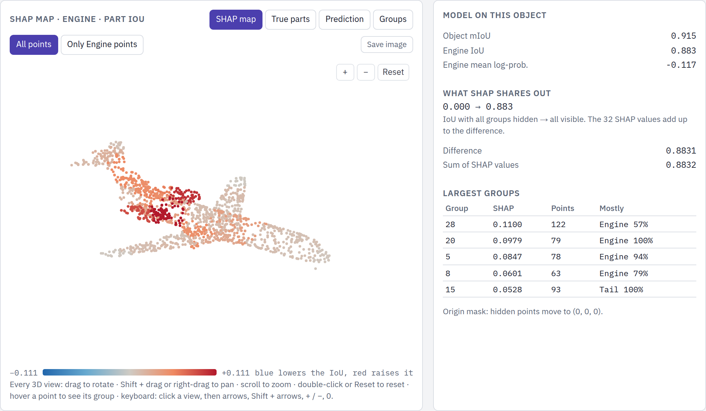
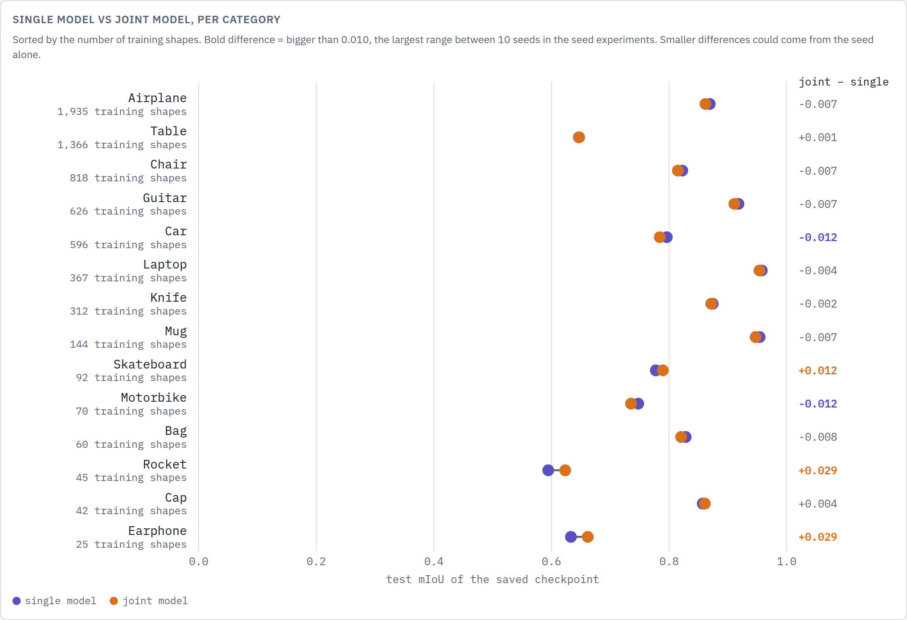

# PointNet++ part segmentation and KernelSHAP explanations

Code and results of a thesis project. It trains PointNet++ (MSG) part-segmentation models on ShapeNetPart and explains their predictions with KernelSHAP over 32 spatial point groups. The XAI study compares a single-category model with a 14-category joint model on six categories: Airplane, Car, Laptop, Motorbike, Rocket and Skateboard.

The model code and the training script start from [Pointnet_Pointnet2_pytorch](https://github.com/yanx27/Pointnet_Pointnet2_pytorch) by Benny (MIT licence, see `LICENSE`). The PointNet++ model, its layers and the data augmentation are unchanged.

## Look at the results

Both explorers are static web pages and work offline. Open them in a browser:

- `log/part_seg/training_explorer/index.html`: all 157 training runs, the test results and the dataset statistics.
- `log/part_seg/full-exp/xai-analysis/xai_explorer/index.html`: the SHAP maps of every test object, with the stability, model, mask and removal checks.

## Key results

*XAI explorer: which point groups raise (red) or lower (blue) the model's IoU for the engines of one airplane.*

*Training Explorer: single-category models against the 14-category joint model.*

- The single models score higher than the joint model in 9 of 14 categories. The difference is larger than the seed noise (0.010) only for Earphone, Rocket and Skateboard, where the joint model is better by 0.012 to 0.029, and for Car and Motorbike, where the single model is better by 0.012.
- The training seed changes the test mIoU very little: over 10 seeds the standard deviation is at most 0.0035.
- The SHAP maps are stable: between SHAP seeds at 8,192 coalitions, the median rank agreement of the group values is 0.93 to 0.99.
- The maps point to the right regions: hiding the groups in SHAP order lowers the score faster than random order in 1,748 of 1,760 cases.
- The maps depend on the method choices: the mask and the model change a map much more than the seed does. Large parts (car body, motorbike frame, skateboard deck, laptop) get the least clear maps.

## What is in the repository

| Path | Content |
|---|---|
| `train_partseg.py` | Trains and tests one model. Writes `config.json`, `metrics_per_epoch.csv`, `sample_counts.csv`, `per_category_miou.csv` and `checkpoints/best_model.pth` into `log/part_seg/<log_dir>/`. |
| `run_experiment.py` | Runs `train_partseg.py` for several categories and seeds. |
| `test_partseg.py` | Tests a saved model again with the same test set as its run. Writes only into `<run>/eval/`. |
| `provider.py`, `models/`, `data_utils/` | Augmentation, PointNet++ and the ShapeNetPart loader (with part filters and caps). |
| `xai/` | The KernelSHAP study: `python -m xai.run <stage> --config <file>`. The 12 study settings are in `xai/final_study/`. |
| `plot_*.py`, `compare_experiments.py` | Figures from the training records. |
| `log/part_seg/` | Training records of all runs, the XAI study manifests, `offline_metrics.csv` and the two explorers. |
| `environment.yml` | The conda environment that produced the results. |

Not in the repository: the dataset, the model checkpoints (3.1 GB) and the raw results of the XAI study (SHAP values and per-object predictions).

## About

I built this project for my M.Sc. thesis *Explainability and Interpretability of Segmentation Methods for 3D Point Clouds of Mechanical Objects* in Artificial Intelligence at the Brandenburg University of Technology Cottbus-Senftenberg. The thesis asks which regions of a 3D object PointNet++ relies on when it labels the parts, and whether these explanations hold when the model, the masking method or the random seed changes.

Contact: [LinkedIn](https://www.linkedin.com/in/abdelrah-alsayed/) · [GitHub](https://github.com/abdelrah-alsayed) · abdelrah.alsayed@gmail.com
